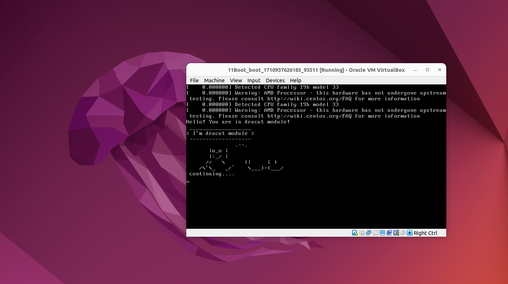

# 1. Попасть в систему без пароля несколькими способами.
### I способ через rd.break

### II способ через init=/bin/bash

# 2. Установить систему с LVM, после чего переименовать VG.

# 3. Добавить модуль в initrd.
Пингвин вышел немного криво)

